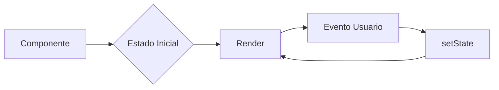
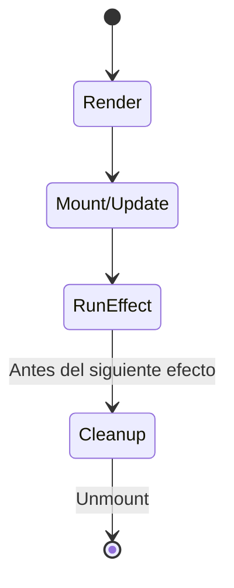
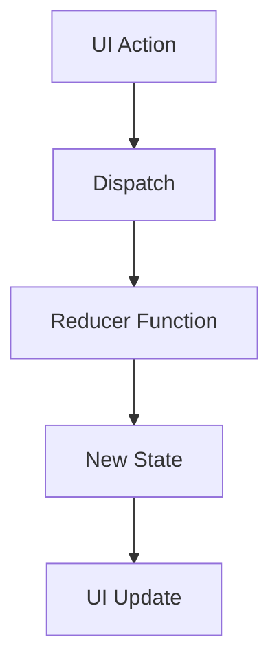
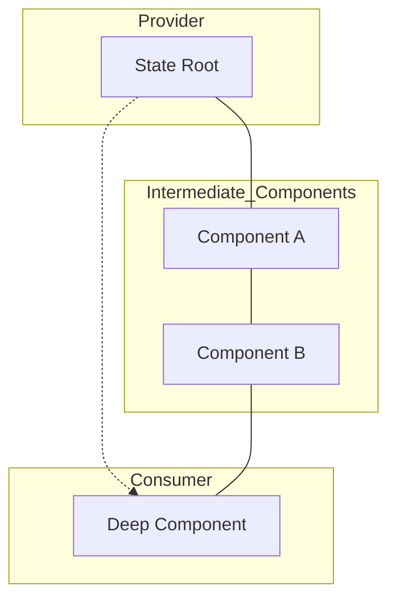
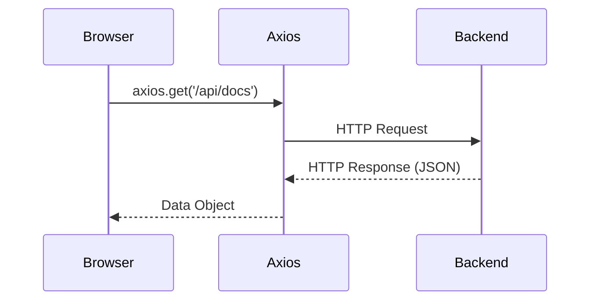
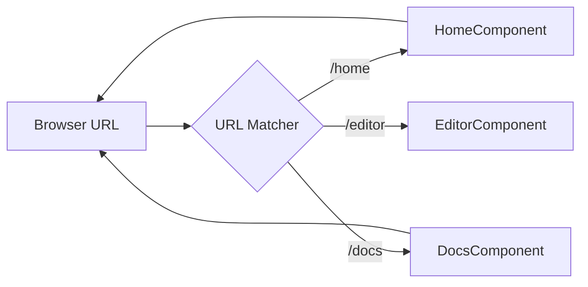
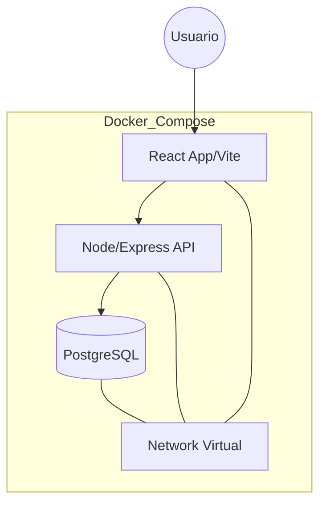

# Conceptos Fundamentales de Desarrollo Web Moderno

**Asignatura:** Desarrollo Web II  
**Formato:** Normas APA 7ma Edición  
**Fecha:** 20 de mayo de 2026  

---

## 1. REST con Swagger

### Definición
REST (Representational State Transfer) es un estilo arquitectónico para sistemas distribuidos basado en el protocolo HTTP. Swagger es un conjunto de herramientas de código abierto (ahora parte de la especificación OpenAPI) que permite diseñar, construir, documentar y consumir servicios web RESTful.

### Funcionalidad
REST permite la comunicación entre cliente y servidor mediante recursos identificados por URIs y métodos estándar (GET, POST, PUT, DELETE). Swagger facilita la documentación automática de estos endpoints, permitiendo a los desarrolladores probar la API de forma interactiva sin necesidad de herramientas externas.

### Ejemplo
```javascript
/**
 * @swagger
 * /api/documentos/{id}:
 *   get:
 *     summary: Obtiene un documento por ID
 *     parameters:
 *       - in: path
 *         name: id
 *         required: true
 *         schema:
 *           type: integer
 */
app.get('/api/documentos/:id', (req, res) => {
    // Lógica para retornar el documento
});
```

---

## 2. ReactJS

### Definición
ReactJS es una biblioteca de JavaScript de código abierto desarrollada por Meta para construir interfaces de usuario basadas en componentes. Se utiliza principalmente para crear aplicaciones de una sola página (SPA).

### Funcionalidad
React utiliza un **Virtual DOM** para optimizar las actualizaciones de la interfaz. Cuando el estado de un componente cambia, React calcula la diferencia mínima necesaria y actualiza solo esa parte del DOM real, lo que resulta en aplicaciones rápidas y fluidas.

### Ejemplo
```jsx
function App() {
  return (
    <div className="App">
      <h1>Hola desde React</h1>
      <ComponenteReutilizable />
    </div>
  );
}
```

---

## 3. Hooks en React

Los Hooks son funciones especializadas que permiten a los componentes funcionales gestionar el estado y los efectos de ciclo de vida sin necesidad de utilizar clases. Introducidos en React 16.8, resolvieron problemas de lógica difícil de reutilizar y complejidad en el código.

### useState
**Definición:** Hook fundamental para añadir memoria al componente.  
**Diagrama de Flujo:**

**Ejemplo Detallado:**
```jsx
function Counter() {
    const [count, setCount] = useState(0); // Estado encapsulado
    return (
        <button onClick={() => setCount(count + 1)}>
            Incrementar: {count}
        </button>
    );
}
```

### useEffect
**Definición:** Gestiona efectos secundarios que no deben ocurrir durante el renderizado (peticiones API, suscripciones).  
**Ciclo de Vida en Hook:**


### useContext
**Definición:** Suscribe componentes funcionales a un contexto.
### useReducer
**Definición:** Gestiona estados complejos a través de una función "reducer".


---

## 4. Context API

### Definición y Arquitectura
Context API es un sistema de gestión de estado nativo que permite evitar el paso de propiedades (props) a través de niveles intermedios del árbol de componentes.

### Flujo de Datos


---

## 5. Peticiones HTTP con Axios

Axios simplifica la comunicación con servidores remotos. A diferencia de `fetch`, Axios maneja automáticamente la conversión a JSON y proporciona interceptores.

### Secuencia de Petición


---

## 6. Rutas y Navegación

El enrutamiento en el cliente permite transiciones de página instantáneas sin recargar el documento HTML completo.

### Gestión de Rutas


---

## 7. Despliegue con Docker

El despliegue moderno se apoya en contenedores para garantizar que el entorno de desarrollo sea idéntico al de producción.

### Arquitectura de Contenedores del Proyecto


---

## Bibliografía
- Meta Open Source. (2024). *React Documentation*. https://react.dev/
- Open API Initiative. (2023). *Swagger documentation*. https://swagger.io/
- Axios. (2024). *Axios Cheat Sheet*. https://axios-http.com/
- Docker Inc. (2024). *Docker Containers Overview*. https://www.docker.com/
